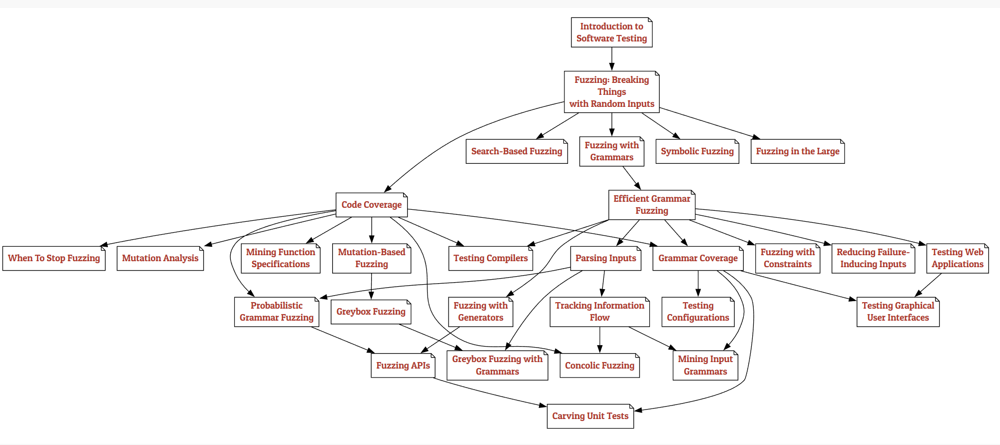

# Sitemap

虽然本书各章节可按顺序阅读，但读者也可根据兴趣选择不同学习路径。图中箭头 \\( A \rightarrow B \\) 表示章节 A 是章节 B 的先修内容。您可以在图中任意选择路径，直达最感兴趣的主题：

- 目录
  - [Part Ⅰ: Whetting Your Appetite](part_1/index.html): 这个章节会介绍这本书各个话题的概要
    - [Tours through the Book](part_1/tours_through_book.html): 本书体量庞大，包含超过 2 万行代码和 15 万文字内容，若印刷成册将超过 1200 页。显然，我们并不要求读者通读全书。
    - [Introduction to Software Testing](part_1/introduction.html): 在进入本书核心内容前，我们先介绍软件测试的基本概念。为何必须进行软件测试？如何实施软件测试？如何判定测试是否成功？怎样确认测试是否充分？本章将回顾关键概念，同时引导读者熟悉 Python 和交互式 notebook 的使用。
  - [Part Ⅱ: Lexical Fuzzing](part_2/index.html): 本部分介绍词法层面的测试生成，即构建字符序列的方法。
    - [Fuzzing: Breaking Things with Random Inputs](part_2/fuzzing_inputs.html): 本章将介绍最简单的测试生成技术之一。随机文本生成（又称模糊测试）的核心思想是向程序输入随机字符序列，以期发现程序缺陷。
    - [Code Coverage](part_2/code_coverage.html): 上一章我们介绍了基础模糊测试——即生成随机输入来测试程序。如何衡量这些测试的有效性？一种方法是统计发现缺陷的数量（及严重程度）；但当缺陷稀少时，我们需要一个能反映测试发现缺陷概率的替代指标。本章将引入代码覆盖率的概念，用于衡量测试运行期间程序实际被执行的部分。对于试图覆盖尽可能多代码的测试生成器而言，覆盖率测量也至关重要。
    - [Mutation-Based Fuzzing](part_2/mutation_based.html): 大多数随机生成的输入在语法上是无效的，因此会很快被处理程序拒绝。为了测试输入处理之外的功能，我们必须提高获得有效输入的概率。其中一种方法是通过变异模糊测试——即对现有输入进行微小改动，这些改动可能保持输入有效性，同时激发新的程序行为。我们将演示如何创建这类变异，并如何引导它们覆盖未被测试的代码，应用流行模糊测试工具 AFL 的核心概念。
    - [Greybox Fuzzing](part_2/greybox_fuzzing.html): 前一章介绍了基于变异的模糊测试技术，该方法通过对给定输入进行微小变异来生成测试用例。本章将展示如何引导这些变异实现特定目标（如提高代码覆盖率）。相关算法源自著名的[American Fuzzy Lop（AFL）](https://lcamtuf.coredump.cx/afl/)模糊测试工具，特别是其[AFLFast](https://github.com/mboehme/aflfast)和[AFLGo](https://github.com/aflgo/aflgo)变种。我们将探讨 AFL 背后的灰盒模糊测试算法，以及如何利用它解决自动化漏洞检测中的各类问题。
    - [Search-Based Fuzzing](part_2/search_based.html): 有时我们不仅关注生成尽可能多样化的程序输入，更希望获得能实现特定目标（如触发程序中特定语句）的测试输入。当我们明确寻找目标时，就可以通过搜索算法实现。搜索算法是计算机科学的核心，但将广度优先或深度优先等经典搜索算法直接应用于测试用例搜索并不现实，因为这些算法可能需要遍历所有可能的输入。不过，领域知识能帮助我们突破这一局限。例如，若能评估多个程序输入中哪个更接近目标，这种信息就能引导我们快速抵达目标——这种引导信息被称为启发式规则。系统化应用启发式规则的方法被归纳为元启发式搜索算法。"元"意味着这些算法具有通用性，可针对不同问题实例化。元启发式算法常借鉴自然界的运行机制，例如模拟进化过程、群体智能或化学反应的算法。总体而言，它们比穷举搜索高效得多，能应对极其庞大的搜索空间——即便是程序输入域这样巨大的搜索空间对它们也不成问题。
    - [Mutation Analysis](part_2/mutation_analysis.html): 在关于[代码覆盖率](part_2/code_coverage.html)的章节中，我们演示了如何识别程序被执行的部分，从而评估测试用例集覆盖程序结构的有效性。然而，仅凭覆盖率可能并非衡量测试有效性的最佳标准，因为即使覆盖率很高，也可能从未验证结果的正确性。本章将介绍另一种评估测试套件有效性的方法：通过向代码中注入变异（即人为缺陷），检验测试套件能否检测到这些人为故障。其核心思想是，如果测试套件无法识别这类变异，那么它同样可能漏掉真实存在的缺陷。
